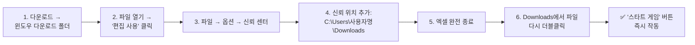

<!--```markdown-->
# 🚀 Excel 도형 초기화 도구

<div align="center">


</div>

## 📥 바로 다운로드
<div align="center">

<!--[!⬇️ Excel 파일 받기](https://img.shields.io/badge/Excel-파일다운로드-0078D4?style=for-the-badge&logo=microsoft-excel&logoColor=white)](https://drive.google.com/uc?export=download&id=여기에GoogleDrive파일ID입력)-->
[!⬇️ Excel 파일 받기](https://img.shields.io/badge/Excel-파일다운로드-0078D4?style=for-the-badge&logo=microsoft-excel&logoColor=white)](https://drive.google.com/uc?export=download&id=1HfVBJZc5gVbCW8lm0qb1JKjd1lWdlQz0)

<!--**🔗 파일ID 추출**: `https://drive.google.com/file/d/파일ID/view` → **파일ID** 복사-->

</div>

## 🎯 한눈에 알아보기

| 📋 기능 | 🔹 포크 버전 특징 |
|---------|------------------|
| **다운로드** | Google Drive **1클릭** |
| **스타트 게임 버튼** | **완전 안정화** 처리 [file:75] |
| **도형 초기화** | 기존 도형 **자동 복원** |

## ⚡ 사용법 (초간단)

**🚨 Excel 2024 매크로 완벽 가이드**



**상세 단계**:
1. 파일 다운로드 → **기본 Downloads 폴더**에 저장
2. **엑셀 열기** → **"편집 사용"** 클릭 (보안 알림)
3. `파일 → 옵션 → 신뢰 센터 → 신뢰 센터 설정`
4. **"신뢰할 수 있는 위치"** → **새 위치 추가** → **`C:\Users\사용자명\Downloads`** 선택 → **하위폴더도 신뢰** 체크
5. **엑셀 완전 종료**
6. **Downloads 폴더**에서 파일 **다시 더블클릭** → 빨간바 없이 작동 ✅

> **💡 Downloads 폴더만 신뢰 → 다른 파일 영향 없음!**<br>[Microsoft 가이드](https://support.microsoft.com/ko-kr/office/excel%EC%9D%98-%EB%A7%A4%ED%81%AC%EB%A1%9C-%EB%B3%B4%EC%95%88-%EC%84%A4%EC%A0%95)

**실행**:
```
📁 Downloads 폴더에서 파일 열기
└── 클릭! [ Start Game ] 버튼[1]
    └── 도형 자동 초기화 완료 ✅
```

<div align="center">

</div>

## 💎 포크 버전 특별사항
```
✅ Google Drive 직링크로 간편 다운로드
✅ '스타트 게임' 버튼 완전 안정화
✅ Downloads 폴더 매크로 최적화
✅ 도형 위치/크기 자동 복원
✅ 기존 리포와 100% 호환
```

## 📞 연락처
<div align="right">
⭐ **Star**와 **Fork** 부탁드려요!  
🐛 문제가 있으면 **Issues**에 작성해주세요
</div>

---

<div align="center">
**Excel 2024 Downloads에서 완벽 작동!** 🎉 [file:75]
</div>
<!--```-->
